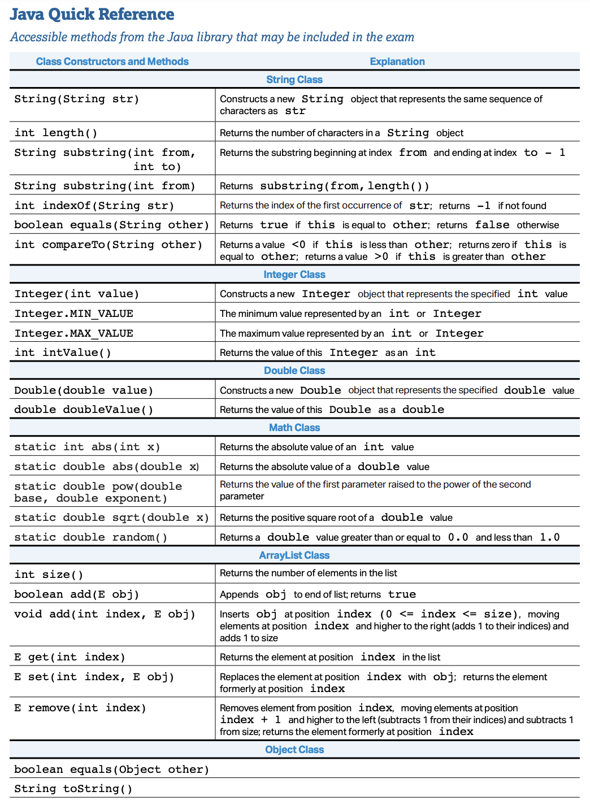
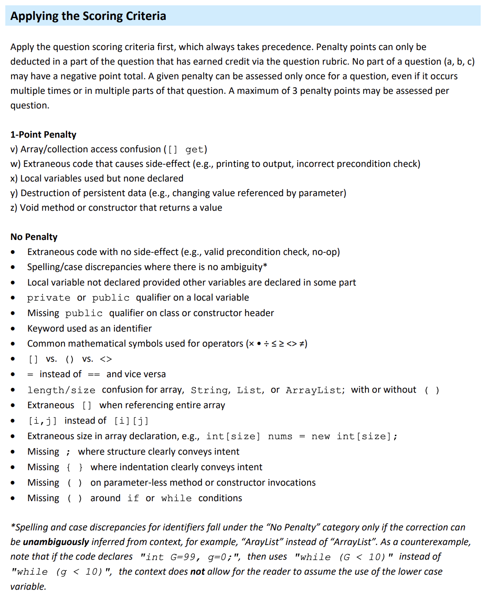

# Triangle Planning Blogs

All the blogs from the triangle blogs to study for the APCSA test. Below are somethings to keep in mind while taking the test and the rubrics that college board uses for the FRQ.

## College Board Java Quick Reference

   
    

## College Board FRQ Scoring Guidline 

   
    

